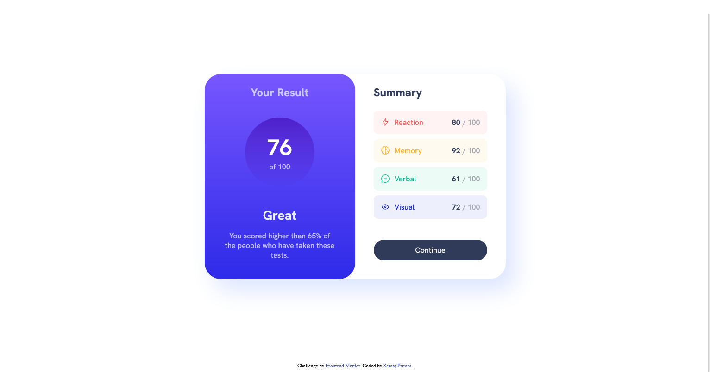
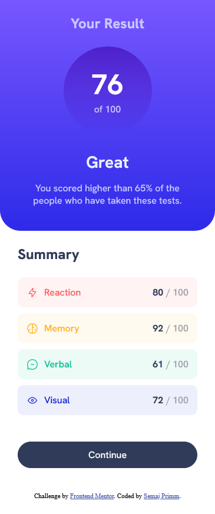

# Frontend Mentor - Results summary component solution

This is a solution to the [Results summary component challenge on Frontend Mentor](https://www.frontendmentor.io/challenges/results-summary-component-CE_K6s0maV). 

## Table of contents

- [Overview](#overview)
  - [The challenge](#the-challenge)
  - [Screenshot](#screenshot)
  - [Links](#links)
- [My process](#my-process)
  - [Built with](#built-with)
  - [What I learned](#what-i-learned)
  - [Useful resources](#useful-resources)
- [Author](#author)


## Overview

### The challenge

Users should be able to:

- View the optimal layout for the interface depending on their device's screen size
- See hover and focus states for all interactive elements on the page

### Screenshot

#### Desktop


#### Mobile


### Links

- Solution URL: [https://github.com/semajthomasprimm/results-summary-component-main](https://github.com/semajthomasprimm/results-summary-component-main)
- Live Site URL: [https://results-summary-component-sp.netlify.app/](https://results-summary-component-sp.netlify.app/)

## My process

### Built with

- Semantic HTML5 markup
- CSS custom properties
- Flexbox

### What I learned
For the Result Section background, I learned how to use CSS the draw a linear gradient.

```css
.left{
  background-image: linear-gradient(hsl(252, 100%, 67%), hsl(241, 81%, 54%));
}
```

For the Results Score section, I learned how to draw a circle using CSS.
```css
.left .results {
  border-radius: 50%;
  background-image: linear-gradient(hsla(256, 72%, 46%, 1), hsla(241, 72%, 46%, 0));
  width: 150px;
  height: 150px;
}
```

I learned how to dynamically change the img DOM src using JS:
```js
document.getElementById("reactionImg").src = data[0].icon
```

### Useful resources

- [Hubspot CSS Border Radius Circle Tutorial](https://blog.hubspot.com/website/css-border-radius-circle) - This helped me for designing the circle for the Result score. I really liked this pattern and will use it going forward.
- [w3schools](https://www.w3schools.com) - This is an useful site which helped me understand HTML DOM properties. I'd recommend it to anyone still learning this concept.

## Author

- Website - [Semaj Primm](https://www.semajprimm.com)
- Frontend Mentor - [@semajthomasprimm](https://www.frontendmentor.io/profile/semajthomasprimm)
